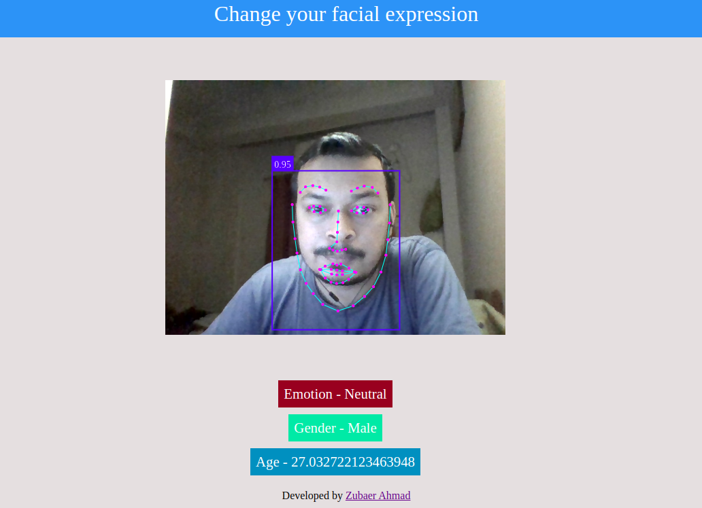
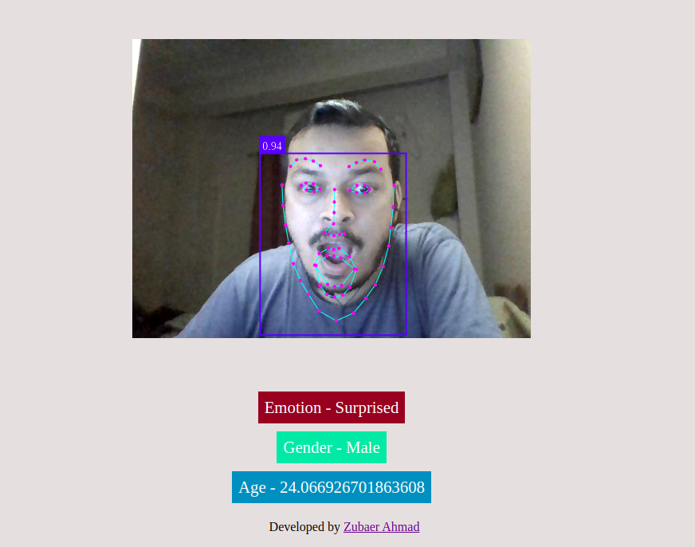
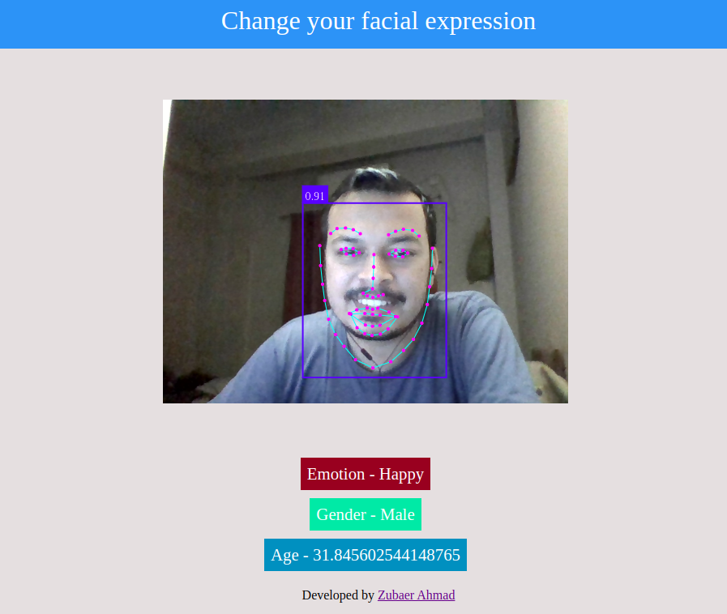

### Preview URL
https://zubaer93.github.io/simple-face-and-expression-detection/

### Description

A simple javascript realtime facial recognition app.

- Using face-api.js models for recognition
- Can recognize face, landmarks, expressions and gender.
- Based on landmark and expression age is predicted

Face API Library: https://github.com/justadudewhohacks/face-api.js

### Project Snapshots

